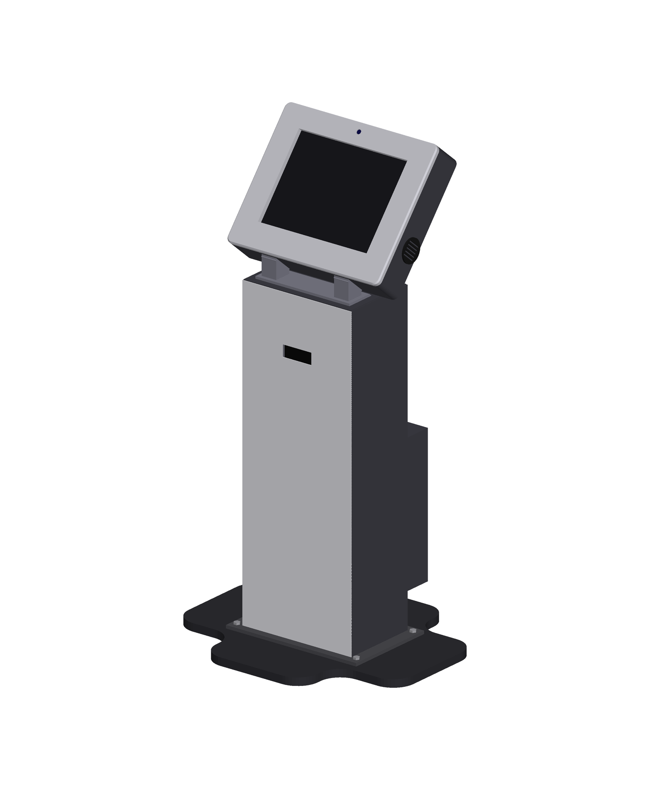

# Automated Attendance Kiosk (extension of AttendEase)

Floor-standing kiosk: tilted 15" display, QR scanner, camera mount, sheet-metal column, rear electronics enclosure, four-lobed base.
About 620 x 520 mm footprint, 1175 mm tall, head tilt 40 deg (30 / 35 deg variants).



## Project status: IN PROGRESS
| Area | Status |
|---|---|
| 3D model (35 parts, no collisions at 30/35/40 deg) | Done |
| BOM, flat patterns (DXF), renders, animations, reference drawings (PDF) | Done |
| Kiosk client app + offline queue, tested against a **mock** API | Done |
| SolidWorks mates + adjustable tilt | [ ] |
| Sheet-metal features and native flat patterns | [ ] |
| Native exploded view + motion study | [ ] |
| Native SolidWorks drawings | [ ] |
| Design analysis (mass, centre of gravity, tip-over) | [ ] |
| Integration with the live AttendEase backend | [ ] (see `05_Docs/BACKEND_INTEGRATION_NOTES.md`) |
| Run on real Raspberry Pi hardware | [ ] |

Tick the boxes as each item is finished.

## How it was made (transparency)
The base geometry was generated with a Python/CadQuery script (`01_CAD/source_scripts/`) with AI assistance and exported as STEP, then opened in SolidWorks. The drawings PDF and renders in this repo were produced by the same scripts as references. Work marked [ ] above is still to be done in SolidWorks.

## Folder map
- `01_CAD/` assembly STEP, 35 part files, tilt variants, DXF flat patterns, BOM, source scripts
- `02_Renders/` images and animations
- `03_Drawings/` 3-sheet reference drawing PDF
- `04_Software/` kiosk app, mock backend, end-to-end test (`python test_flow.py`), architecture diagram
- `05_Docs/` SolidWorks guide, study guide, resume text, backend notes

## Run the software test
```
pip install -r 04_Software/requirements.txt
cd 04_Software && python test_flow.py
```
